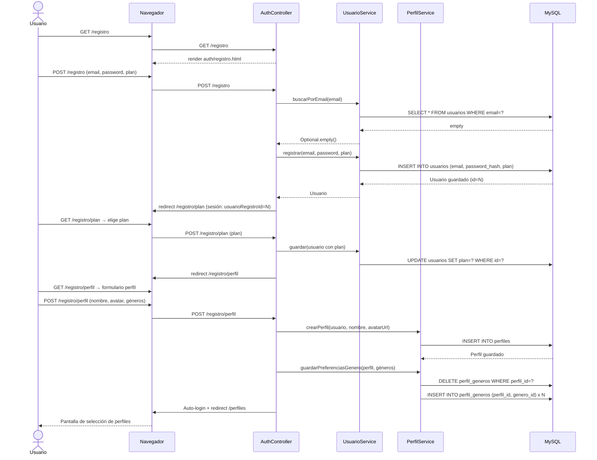
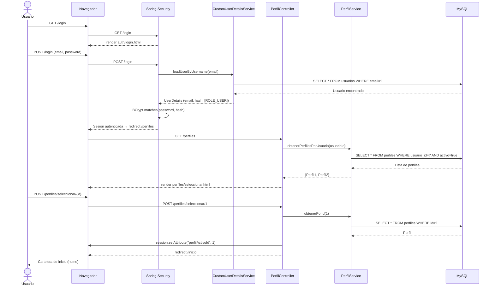
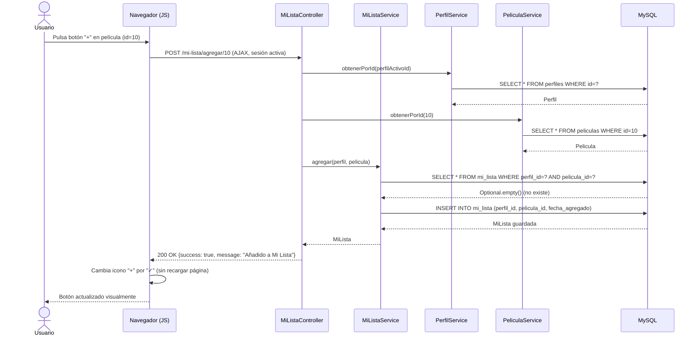
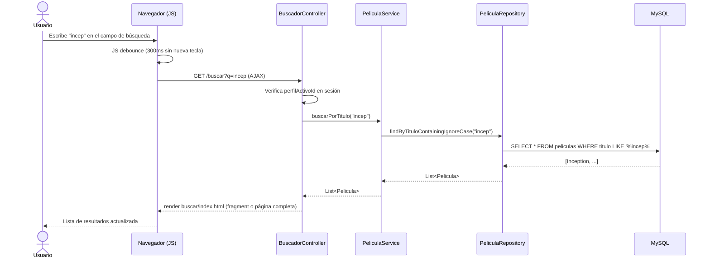
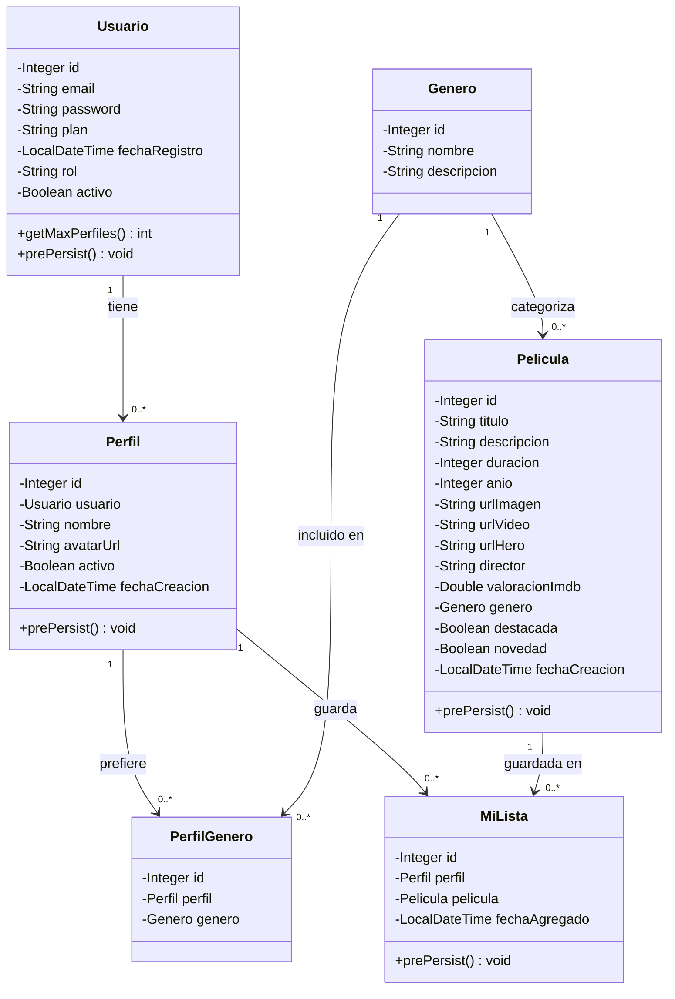

# CineTrack

> Plataforma web de streaming de películas inspirada en Netflix.  
> Proyecto transversal final DAW/DAM.


---

## Estado actual — v0.4.0-dev

El núcleo funcional está completamente operativo. La aplicación arranca, se conecta a la base de datos y todas las funcionalidades principales funcionan end-to-end. Se siguen añadiendo mejoras de UX y funcionalidades.

## Stack tecnológico

| Capa | Tecnología |
|---|---|
| Backend | Java 17 + Spring Boot 3.3.5 |
| Frontend | Thymeleaf + Bootstrap 5.3 |
| Base de datos | MySQL 8 |
| Seguridad | Spring Security + BCrypt |
| ORM | Spring Data JPA / Hibernate |
| Control de versiones | Git + GitHub |

## Funcionalidades implementadas

- **Registro y autenticación** — Flujo completo: email → plan → creación de perfil → login automático
- **Sistema de perfiles múltiples** — Hasta 5 perfiles por cuenta según el plan contratado
- **Catálogo de películas** — 31 películas clásicas reales con directores y valoraciones IMDb
- **Cartelera de inicio** — Carousel de novedades + filas por género al estilo Netflix
- **Buscador en tiempo real** — Búsqueda con sugerencias dinámicas vía AJAX
- **Sugerencias personalizadas** — Basadas en géneros favoritos del perfil activo
- **Mi Lista** — Guardado de películas por perfil con respuesta AJAX
- **Página de detalle** — Director, valoración IMDb, video bajo demanda y películas relacionadas
- **Panel de administración** — CRUD completo de películas, géneros y usuarios con subida de archivos
- **Gestión de avatares** — Presets predefinidos o imagen personalizada (upload)
- **Cuenta de usuario** — Cambio de contraseña y cambio de plan de suscripción
- **Diseño responsive** — Bootstrap 5 adaptado a móvil, tablet y escritorio

## Estructura del repositorio

```
cinetrack/
├── app/                    # Proyecto Spring Boot
│   ├── src/main/java/      # Código Java (MVC)
│   ├── src/main/resources/ # Templates, CSS, JS, config
│   └── uploads/            # Archivos subidos (imágenes, vídeos)
├── database/
│   ├── schema/             # Scripts SQL (tablas, relaciones, seeds)
│   └── migrations/         # Migraciones incrementales
├── docs/                   # Documentación técnica y arquitectura
│   ├── atlas/              # Roadmap y notas de arquitectura
│   └── er/                 # Modelo relacional y ER
├── scripts/                # Scripts de inicialización (Windows y Linux)
└── README.md
```

## Puesta en marcha desde cero (clon fresco)

### Opción A — Script automático (recomendado para Windows + XAMPP)

1. Iniciar MySQL en XAMPP (panel de control → Start MySQL)
2. Ejecutar el script de inicialización desde la raíz del proyecto:
   ```powershell
   .\scripts\setup-db.ps1
   # Si tienes contraseña en MySQL:
   .\scripts\setup-db.ps1 -Password "tupassword"
   ```
3. Arrancar la aplicación:
   ```powershell
   cd app
   .\mvnw.cmd spring-boot:run
   ```
4. Acceder a `http://localhost:8080`

El script crea la base de datos `cinetrack_db`, carga toda la estructura y los datos de prueba (31 películas, 6 géneros). El usuario administrador se crea automáticamente al arrancar la app.

### Opción B — Manual (MySQL CLI)

```bash
mysql -u root < database/init.sql
cd app && ./mvnw spring-boot:run
```

### Opción C — Linux (VirtualBox / Ubuntu / macOS)

1. Instalar dependencias:
   ```bash
   sudo apt update
   sudo apt install -y openjdk-17-jdk mysql-server git
   sudo systemctl start mysql
   ```
2. Clonar el repositorio y ejecutar el script de inicialización:
   ```bash
   git clone https://github.com/JRK11177YT/Cinetrack.git cinetrack
   cd cinetrack
   bash scripts/setup-db.sh
   ```
3. Arrancar la aplicación:
   ```bash
   cd app
   chmod +x mvnw
   ./mvnw spring-boot:run
   ```
4. Acceder a `http://localhost:8080`

---

**Credenciales por defecto:**
- Admin: `admin@cinetrack.com` / `admin123`
- Panel de administración: `http://localhost:8080/admin`

## Credenciales de acceso

| Rol | Email | Contraseña |
|---|---|---|
| Administrador | admin@cinetrack.com | admin123 |

## Documentación técnica y diagramas

### Diagrama de Casos de Uso

#### Actores

| Actor | Descripción |
|---|---|
| **Usuario no autenticado** | Visitante sin sesión activa |
| **Usuario autenticado** | Cuenta registrada con sesión iniciada |
| **Perfil activo** | Perfil seleccionado dentro de una sesión |
| **Administrador** | Cuenta con rol `ADMIN`, accede al panel de gestión |

```mermaid
graph TD
    subgraph Actores
        UA[👤 Usuario no autenticado]
        UL[👤 Usuario autenticado]
        PA[👤 Perfil activo]
        AD[👤 Administrador]
    end

    subgraph UC_AUTH["Autenticación y registro"]
        UC1(Registrarse)
        UC2(Elegir plan de suscripción)
        UC3(Crear perfil inicial)
        UC4(Iniciar sesión)
        UC5(Cerrar sesión)
        UC6(Recordar sesión)
    end

    subgraph UC_PERFILES["Gestión de perfiles"]
        UC7(Seleccionar perfil activo)
        UC8(Crear nuevo perfil)
        UC9(Editar perfil)
        UC10(Eliminar perfil)
        UC11(Gestionar géneros favoritos)
        UC12(Cambiar avatar)
    end

    subgraph UC_CATALOGO["Catálogo y búsqueda"]
        UC13(Ver cartelera de inicio)
        UC14(Buscar película por título)
        UC15(Ver detalle de película)
        UC16(Ver sugerencias personalizadas)
    end

    subgraph UC_MILISTA["Mi Lista"]
        UC17(Añadir película a Mi Lista)
        UC18(Eliminar película de Mi Lista)
        UC19(Ver Mi Lista)
    end

    subgraph UC_CUENTA["Gestión de cuenta"]
        UC20(Cambiar contraseña)
        UC21(Cambiar plan de suscripción)
    end

    subgraph UC_ADMIN["Panel de administración"]
        UC22(Ver dashboard con estadísticas)
        UC23(Gestionar películas — CRUD)
        UC24(Gestionar géneros — CRUD)
        UC25(Gestionar usuarios — CRUD)
        UC26(Subir imagen / vídeo de película)
    end

    UA --> UC1
    UC1 --> UC2
    UC2 --> UC3
    UA --> UC4
    UC4 --> UC6

    UL --> UC5
    UL --> UC7
    UL --> UC8
    UL --> UC9
    UL --> UC10
    UL --> UC20
    UL --> UC21

    UC7 --> PA

    PA --> UC11
    PA --> UC12
    PA --> UC13
    PA --> UC14
    PA --> UC15
    PA --> UC16
    PA --> UC17
    PA --> UC18
    PA --> UC19

    AD --> UC22
    AD --> UC23
    AD --> UC24
    AD --> UC25
    UC23 --> UC26
```



---

### Diagramas de Secuencia

#### DS-01: Registro completo de usuario



#### DS-02: Inicio de sesión y selección de perfil



#### DS-03: Añadir película a Mi Lista (flujo AJAX)



#### DS-04: Búsqueda de películas en tiempo real (AJAX)



---

### Diagrama de Clases

#### Capa de Modelo (Entidades JPA)



#### Capa de Repositorios (Spring Data JPA)

```mermaid
classDiagram
    class UsuarioRepository {
        <<interface>>
        +findByEmail(String) Optional~Usuario~
        +findByActivoTrue() Iterable~Usuario~
        +count() long
    }

    class PerfilRepository {
        <<interface>>
        +findByUsuarioIdAndActivoTrue(Integer) List~Perfil~
        +countByUsuarioId(Integer) long
    }

    class PeliculaRepository {
        <<interface>>
        +findByDestacadaTrue() List~Pelicula~
        +findByNovedadTrue() List~Pelicula~
        +findByGeneroId(Integer) List~Pelicula~
        +findByTituloContainingIgnoreCase(String) List~Pelicula~
        +findTop5ByOrderByFechaCreacionDesc() List~Pelicula~
        +count() long
    }

    class GeneroRepository {
        <<interface>>
        +findByNombreIgnoreCase(String) Optional~Genero~
        +count() long
    }

    class PerfilGeneroRepository {
        <<interface>>
        +findByPerfilId(Integer) List~PerfilGenero~
        +deleteByPerfilId(Integer) void
    }

    class MiListaRepository {
        <<interface>>
        +findByPerfilIdOrderByFechaAgregadoDesc(Integer) List~MiLista~
        +findByPerfilIdAndPeliculaId(Integer, Integer) Optional~MiLista~
        +existsByPerfilIdAndPeliculaId(Integer, Integer) boolean
        +deleteByPerfilId(Integer) void
    }

    UsuarioRepository ..> Usuario : gestiona
    PerfilRepository ..> Perfil : gestiona
    PeliculaRepository ..> Pelicula : gestiona
    GeneroRepository ..> Genero : gestiona
    PerfilGeneroRepository ..> PerfilGenero : gestiona
    MiListaRepository ..> MiLista : gestiona
```



#### Capa de Servicios

```mermaid
classDiagram
    class UsuarioService {
        -UsuarioRepository usuarioRepository
        -PasswordEncoder passwordEncoder
        +findAll() List~Usuario~
        +obtenerPorId(Integer) Optional~Usuario~
        +buscarPorEmail(String) Optional~Usuario~
        +registrar(String, String, String) Usuario
        +guardar(Usuario) Usuario
        +eliminar(Integer) void
        +contar() long
    }

    class PerfilService {
        -PerfilRepository perfilRepository
        -PerfilGeneroRepository perfilGeneroRepository
        -MiListaRepository miListaRepository
        +obtenerPerfilesPorUsuario(Integer) List~Perfil~
        +obtenerPorId(Integer) Optional~Perfil~
        +guardar(Perfil) Perfil
        +crearPerfil(Usuario, String, String) Perfil
        +contarPerfilesPorUsuario(Integer) long
        +guardarPreferenciasGenero(Perfil, List~Genero~) void
        +eliminar(Integer) void
    }

    class PeliculaService {
        -PeliculaRepository peliculaRepository
        +obtenerTodas() List~Pelicula~
        +obtenerPorId(Integer) Optional~Pelicula~
        +obtenerDestacadas() List~Pelicula~
        +obtenerNovedades() List~Pelicula~
        +buscarPorTitulo(String) List~Pelicula~
        +obtenerPorGenero(Integer) List~Pelicula~
        +obtenerPorGeneros(List~Integer~) List~Pelicula~
        +guardar(Pelicula) Pelicula
        +eliminar(Integer) void
        +contar() long
        +obtenerRecientes(int) List~Pelicula~
    }

    class GeneroService {
        -GeneroRepository generoRepository
        +obtenerTodos() List~Genero~
        +obtenerPorId(Integer) Optional~Genero~
        +buscarPorNombre(String) Optional~Genero~
        +guardar(Genero) Genero
        +eliminar(Integer) void
        +contar() long
    }

    class MiListaService {
        -MiListaRepository miListaRepository
        +obtenerListaPorPerfil(Integer) List~MiLista~
        +estaEnMiLista(Integer, Integer) boolean
        +agregar(Perfil, Pelicula) MiLista
        +eliminar(Integer, Integer) void
    }

    UsuarioService --> UsuarioRepository : usa
    PerfilService --> PerfilRepository : usa
    PerfilService --> PerfilGeneroRepository : usa
    PerfilService --> MiListaRepository : usa
    PeliculaService --> PeliculaRepository : usa
    GeneroService --> GeneroRepository : usa
    MiListaService --> MiListaRepository : usa
```



#### Capa de Controladores (MVC completo)

```mermaid
classDiagram
    class AuthController {
        -UsuarioService usuarioService
        -PerfilService perfilService
        -GeneroService generoService
        +login() String
        +registroForm() String
        +registroProcesar() String
        +planForm() String
        +planProcesar() String
        +crearPerfilForm() String
        +crearPerfilProcesar() String
    }

    class HomeController {
        -PeliculaService peliculaService
        -GeneroService generoService
        -PerfilService perfilService
        +root() String
        +inicio() String
    }

    class PerfilController {
        -PerfilService perfilService
        -UsuarioService usuarioService
        -GeneroService generoService
        +seleccionarPerfil() String
        +activarPerfil() String
        +nuevoPerfil() String
        +editarPerfil() String
        +guardarPerfil() String
        +eliminarPerfil() String
    }

    class PeliculaController {
        -PeliculaService peliculaService
        -GeneroService generoService
        -MiListaService miListaService
        -PerfilService perfilService
        +detalle() String
    }

    class BuscadorController {
        -PeliculaService peliculaService
        +buscar() String
    }

    class MiListaController {
        -MiListaService miListaService
        -PeliculaService peliculaService
        -PerfilService perfilService
        +miLista() String
        +agregar() ResponseEntity
        +eliminar() ResponseEntity
    }

    class CuentaController {
        -UsuarioService usuarioService
        -PasswordEncoder passwordEncoder
        +miCuenta() String
        +cambiarPassword() String
        +cambiarPlan() String
    }

    class AdminController {
        -PeliculaService peliculaService
        -GeneroService generoService
        -UsuarioService usuarioService
        -PasswordEncoder passwordEncoder
        +dashboard() String
        +listaPeliculas() String
        +crearPelicula() String
        +editarPelicula() String
        +eliminarPelicula() String
        +listaGeneros() String
        +listaUsuarios() String
    }

    AuthController --> UsuarioService : usa
    AuthController --> PerfilService : usa
    AuthController --> GeneroService : usa
    HomeController --> PeliculaService : usa
    HomeController --> GeneroService : usa
    HomeController --> PerfilService : usa
    PerfilController --> PerfilService : usa
    PerfilController --> UsuarioService : usa
    PerfilController --> GeneroService : usa
    PeliculaController --> PeliculaService : usa
    PeliculaController --> GeneroService : usa
    PeliculaController --> MiListaService : usa
    PeliculaController --> PerfilService : usa
    MiListaController --> MiListaService : usa
    MiListaController --> PeliculaService : usa
    MiListaController --> PerfilService : usa
    BuscadorController --> PeliculaService : usa
    CuentaController --> UsuarioService : usa
    AdminController --> PeliculaService : usa
    AdminController --> GeneroService : usa
    AdminController --> UsuarioService : usa
```



---

## Autor

**Jorge Ruiz** — Proyecto académico DAW/DAM
