# Diagrama de Casos de Uso — CineTrack

## Actores

| Actor | Descripción |
|---|---|
| **Usuario no autenticado** | Visitante sin sesión activa |
| **Usuario autenticado** | Cuenta registrada con sesión iniciada |
| **Perfil activo** | Perfil seleccionado dentro de una sesión |
| **Administrador** | Cuenta con rol `ADMIN`, accede al panel de gestión |

---

## Diagrama

```mermaid
graph TD
    subgraph Actores
        UA[👤 Usuario no autenticado]
        UL[👤 Usuario autenticado]
        PA[👤 Perfil activo]
        AD[👤 Administrador]
    end

    subgraph UC_AUTH["Autenticación y registro"]
        UC1(Registrarse)
        UC2(Elegir plan de suscripción)
        UC3(Crear perfil inicial)
        UC4(Iniciar sesión)
        UC5(Cerrar sesión)
        UC6(Recordar sesión)
    end

    subgraph UC_PERFILES["Gestión de perfiles"]
        UC7(Seleccionar perfil activo)
        UC8(Crear nuevo perfil)
        UC9(Editar perfil)
        UC10(Eliminar perfil)
        UC11(Gestionar géneros favoritos)
        UC12(Cambiar avatar)
    end

    subgraph UC_CATALOGO["Catálogo y búsqueda"]
        UC13(Ver cartelera de inicio)
        UC14(Buscar película por título)
        UC15(Ver detalle de película)
        UC16(Ver sugerencias personalizadas)
    end

    subgraph UC_MILISTA["Mi Lista"]
        UC17(Añadir película a Mi Lista)
        UC18(Eliminar película de Mi Lista)
        UC19(Ver Mi Lista)
    end

    subgraph UC_CUENTA["Gestión de cuenta"]
        UC20(Cambiar contraseña)
        UC21(Cambiar plan de suscripción)
    end

    subgraph UC_ADMIN["Panel de administración"]
        UC22(Ver dashboard con estadísticas)
        UC23(Gestionar películas — CRUD)
        UC24(Gestionar géneros — CRUD)
        UC25(Gestionar usuarios — CRUD)
        UC26(Subir imagen / vídeo de película)
    end

    UA --> UC1
    UC1 --> UC2
    UC2 --> UC3
    UA --> UC4
    UC4 --> UC6

    UL --> UC5
    UL --> UC7
    UL --> UC8
    UL --> UC9
    UL --> UC10
    UL --> UC20
    UL --> UC21

    UC7 --> PA

    PA --> UC11
    PA --> UC12
    PA --> UC13
    PA --> UC14
    PA --> UC15
    PA --> UC16
    PA --> UC17
    PA --> UC18
    PA --> UC19

    AD --> UC22
    AD --> UC23
    AD --> UC24
    AD --> UC25
    UC23 --> UC26
```

---

## Descripción de casos de uso principales

### CU-01: Registrarse

| Campo | Detalle |
|---|---|
| **Actor** | Usuario no autenticado |
| **Precondición** | El email no existe en el sistema |
| **Flujo principal** | 1. Introduce email y contraseña → 2. Elige plan → 3. Crea perfil inicial con nombre y avatar → 4. Login automático |
| **Postcondición** | Cuenta activa, sesión iniciada, redirige a `/perfiles` |
| **Excepciones** | Email duplicado, contraseñas no coinciden |

### CU-04: Iniciar sesión

| Campo | Detalle |
|---|---|
| **Actor** | Usuario no autenticado |
| **Precondición** | Cuenta existente y activa |
| **Flujo principal** | 1. Introduce email y contraseña → 2. Spring Security valida → 3. Redirige a `/perfiles` |
| **Postcondición** | Sesión HTTP activa con usuario autenticado |
| **Excepciones** | Credenciales incorrectas → `/login?error=true` |

### CU-07: Seleccionar perfil activo

| Campo | Detalle |
|---|---|
| **Actor** | Usuario autenticado |
| **Precondición** | Al menos un perfil activo asociado a la cuenta |
| **Flujo principal** | 1. Se muestran los perfiles → 2. El usuario selecciona uno → 3. Se guarda `perfilActivoId` en sesión → 4. Redirige a `/inicio` |
| **Postcondición** | `perfilActivoId` disponible en sesión, acceso al contenido habilitado |

### CU-15: Ver detalle de película

| Campo | Detalle |
|---|---|
| **Actor** | Perfil activo |
| **Precondición** | Perfil activo en sesión |
| **Flujo principal** | 1. Pulsa en una película → 2. Se carga director, valoración IMDb, géneros, vídeo y películas relacionadas → 3. Se muestra si ya está en Mi Lista |
| **Postcondición** | Información completa de la película presentada |

### CU-17: Añadir película a Mi Lista

| Campo | Detalle |
|---|---|
| **Actor** | Perfil activo |
| **Precondición** | La película no está ya en Mi Lista del perfil |
| **Flujo principal** | 1. Pulsa el botón "+" → 2. Petición AJAX a `/mi-lista/agregar/{id}` → 3. Inserta registro en `mi_lista` → 4. Respuesta JSON `{success: true}` → 5. Botón cambia a check |
| **Postcondición** | Película en Mi Lista del perfil activo |
| **Excepción** | Película ya existente → devuelve registro existente sin duplicar |

### CU-22: Ver dashboard de administración

| Campo | Detalle |
|---|---|
| **Actor** | Administrador |
| **Precondición** | Sesión activa con rol `ADMIN` |
| **Flujo principal** | 1. Accede a `/admin` → 2. Se ejecutan COUNT queries en BD → 3. Muestra totales y últimas 5 películas |
| **Postcondición** | Información de gestión presentada sin cargar tablas completas |
