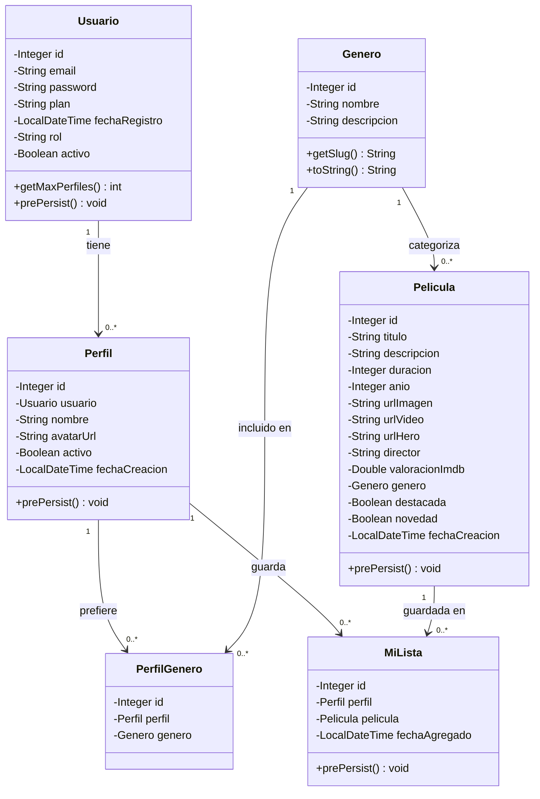

# Diagrama de Clases — CineTrack

Muestra la arquitectura MVC completa: modelos JPA, repositorios, servicios y controladores con sus relaciones reales de dependencia.

---

## Capa de Modelo (Entidades JPA)

---

## Capa de Repositorios (Spring Data JPA)

```mermaid
classDiagram
    class UsuarioRepository {
        <<interface>>
        +findByEmail(String) Optional~Usuario~
        +findByActivoTrue() Iterable~Usuario~
        +count() long
    }

    class PerfilRepository {
        <<interface>>
        +findByUsuarioIdAndActivoTrue(Integer) List~Perfil~
        +countByUsuarioId(Integer) long
    }

    class PeliculaRepository {
        <<interface>>
        +findByDestacadaTrue() List~Pelicula~
        +findByNovedadTrue() List~Pelicula~
        +findByGeneroId(Integer) List~Pelicula~
        +findByTituloContainingIgnoreCase(String) List~Pelicula~
        +findTop5ByOrderByFechaCreacionDesc() List~Pelicula~
        +count() long
    }

    class GeneroRepository {
        <<interface>>
        +findByNombreIgnoreCase(String) Optional~Genero~
        +count() long
    }

    class PerfilGeneroRepository {
        <<interface>>
        +findByPerfilId(Integer) List~PerfilGenero~
        +deleteByPerfilId(Integer) void
    }

    class MiListaRepository {
        <<interface>>
        +findByPerfilIdOrderByFechaAgregadoDesc(Integer) List~MiLista~
        +findByPerfilIdAndPeliculaId(Integer, Integer) Optional~MiLista~
        +existsByPerfilIdAndPeliculaId(Integer, Integer) boolean
        +deleteByPerfilId(Integer) void
    }

    UsuarioRepository ..> Usuario : gestiona
    PerfilRepository ..> Perfil : gestiona
    PeliculaRepository ..> Pelicula : gestiona
    GeneroRepository ..> Genero : gestiona
    PerfilGeneroRepository ..> PerfilGenero : gestiona
    MiListaRepository ..> MiLista : gestiona
```

---

## Capa de Servicios

```mermaid
classDiagram
    class UsuarioService {
        -UsuarioRepository usuarioRepository
        -PasswordEncoder passwordEncoder
        +findAll() List~Usuario~
        +obtenerPorId(Integer) Optional~Usuario~
        +buscarPorEmail(String) Optional~Usuario~
        +registrar(String, String, String) Usuario
        +guardar(Usuario) Usuario
        +eliminar(Integer) void
        +contar() long
    }

    class PerfilService {
        -PerfilRepository perfilRepository
        -PerfilGeneroRepository perfilGeneroRepository
        -MiListaRepository miListaRepository
        +obtenerPerfilesPorUsuario(Integer) List~Perfil~
        +obtenerPorId(Integer) Optional~Perfil~
        +guardar(Perfil) Perfil
        +crearPerfil(Usuario, String, String) Perfil
        +contarPerfilesPorUsuario(Integer) long
        +guardarPreferenciasGenero(Perfil, List~Genero~) void
        +eliminar(Integer) void
    }

    class PeliculaService {
        -PeliculaRepository peliculaRepository
        +obtenerTodas() List~Pelicula~
        +obtenerPorId(Integer) Optional~Pelicula~
        +obtenerDestacadas() List~Pelicula~
        +obtenerNovedades() List~Pelicula~
        +buscarPorTitulo(String) List~Pelicula~
        +obtenerPorGenero(Integer) List~Pelicula~
        +obtenerPorGeneros(List~Integer~) List~Pelicula~
        +guardar(Pelicula) Pelicula
        +eliminar(Integer) void
        +contar() long
        +obtenerRecientes(int) List~Pelicula~
    }

    class GeneroService {
        -GeneroRepository generoRepository
        +obtenerTodos() List~Genero~
        +obtenerPorId(Integer) Optional~Genero~
        +buscarPorNombre(String) Optional~Genero~
        +guardar(Genero) Genero
        +eliminar(Integer) void
        +contar() long
    }

    class MiListaService {
        -MiListaRepository miListaRepository
        +obtenerListaPorPerfil(Integer) List~MiLista~
        +estaEnMiLista(Integer, Integer) boolean
        +agregar(Perfil, Pelicula) MiLista
        +eliminar(Integer, Integer) void
    }

    UsuarioService --> UsuarioRepository : usa
    PerfilService --> PerfilRepository : usa
    PerfilService --> PerfilGeneroRepository : usa
    PerfilService --> MiListaRepository : usa
    PeliculaService --> PeliculaRepository : usa
    GeneroService --> GeneroRepository : usa
    MiListaService --> MiListaRepository : usa
```

---

## Capa de Controladores (MVC completo)

```mermaid
classDiagram
    class AuthController {
        -UsuarioService usuarioService
        -PerfilService perfilService
        -GeneroService generoService
        +login() String
        +registroForm() String
        +registroProcesar() String
        +planForm() String
        +planProcesar() String
        +crearPerfilForm() String
        +crearPerfilProcesar() String
    }

    class HomeController {
        -PeliculaService peliculaService
        -GeneroService generoService
        -PerfilService perfilService
        +root() String
        +inicio() String
    }

    class PerfilController {
        -PerfilService perfilService
        -UsuarioService usuarioService
        -GeneroService generoService
        +seleccionarPerfil() String
        +activarPerfil() String
        +nuevoPerfil() String
        +editarPerfil() String
        +guardarPerfil() String
        +eliminarPerfil() String
    }

    class PeliculaController {
        -PeliculaService peliculaService
        -GeneroService generoService
        -MiListaService miListaService
        -PerfilService perfilService
        +detalle() String
    }

    class BuscadorController {
        -PeliculaService peliculaService
        +buscar() String
    }

    class SugerenciasController {
        -PeliculaService peliculaService
        -PerfilService perfilService
        -PerfilGeneroRepository perfilGeneroRepository
        +sugerencias() String
    }

    class MiListaController {
        -MiListaService miListaService
        -PeliculaService peliculaService
        -PerfilService perfilService
        +miLista() String
        +agregar() ResponseEntity
        +eliminar() ResponseEntity
    }

    class CuentaController {
        -UsuarioService usuarioService
        -PasswordEncoder passwordEncoder
        +miCuenta() String
        +cambiarPassword() String
        +cambiarPlan() String
    }

    class AdminController {
        -PeliculaService peliculaService
        -GeneroService generoService
        -UsuarioService usuarioService
        -PasswordEncoder passwordEncoder
        +dashboard() String
        +listaPeliculas() String
        +crearPelicula() String
        +editarPelicula() String
        +eliminarPelicula() String
        +listaGeneros() String
        +listaUsuarios() String
    }

    AuthController --> UsuarioService : usa
    AuthController --> PerfilService : usa
    AuthController --> GeneroService : usa
    HomeController --> PeliculaService : usa
    HomeController --> GeneroService : usa
    HomeController --> PerfilService : usa
    PerfilController --> PerfilService : usa
    PerfilController --> UsuarioService : usa
    PerfilController --> GeneroService : usa
    PeliculaController --> PeliculaService : usa
    PeliculaController --> GeneroService : usa
    PeliculaController --> MiListaService : usa
    PeliculaController --> PerfilService : usa
    MiListaController --> MiListaService : usa
    MiListaController --> PeliculaService : usa
    MiListaController --> PerfilService : usa
    BuscadorController --> PeliculaService : usa
    SugerenciasController --> PeliculaService : usa
    SugerenciasController --> PerfilService : usa
    CuentaController --> UsuarioService : usa
    AdminController --> PeliculaService : usa
    AdminController --> GeneroService : usa
    AdminController --> UsuarioService : usa
```

