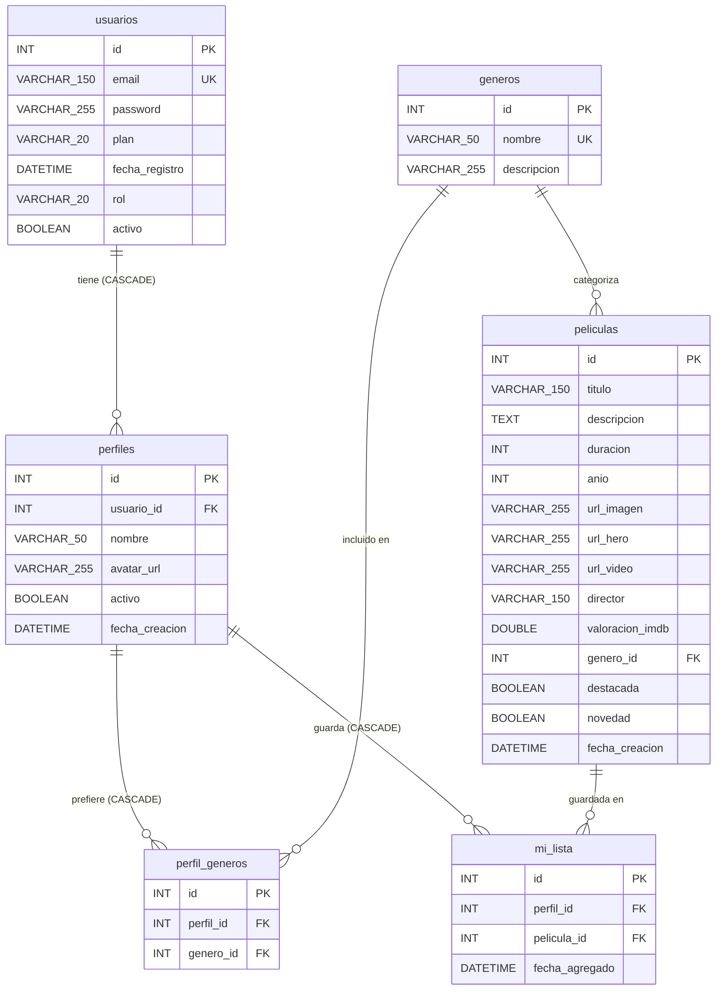

# Modelo relacional de CineTrack

## Diagrama Entidad-Relación

## Resumen de restricciones

| Tabla | Restricción única |
|---|---|
| `usuarios` | `email` |
| `generos` | `nombre` |
| `perfil_generos` | `(perfil_id, genero_id)` |
| `mi_lista` | `(perfil_id, pelicula_id)` |

## Relaciones

| Relación | Cardinalidad | ON DELETE |
|---|---|---|
| `usuarios` → `perfiles` | 1:N | CASCADE |
| `generos` → `peliculas` | 1:N | RESTRICT |
| `perfiles` → `perfil_generos` | 1:N | CASCADE |
| `generos` → `perfil_generos` | 1:N | RESTRICT |
| `perfiles` → `mi_lista` | 1:N | CASCADE |
| `peliculas` → `mi_lista` | 1:N | RESTRICT |
