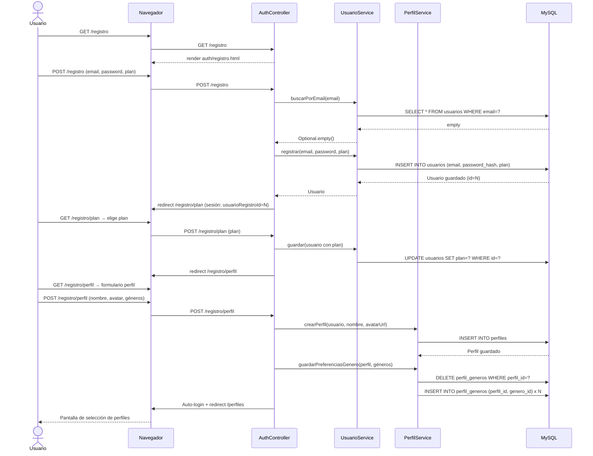
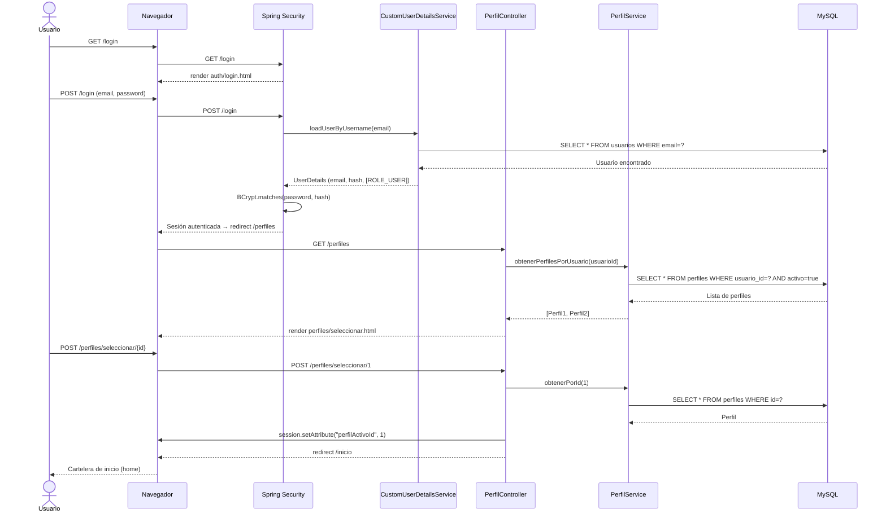
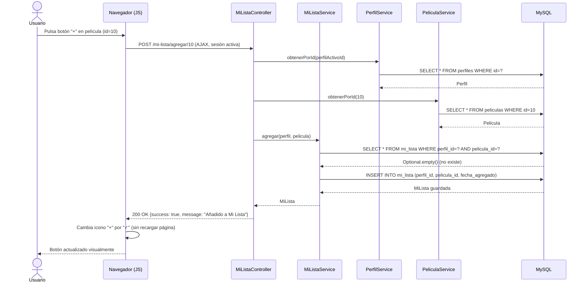
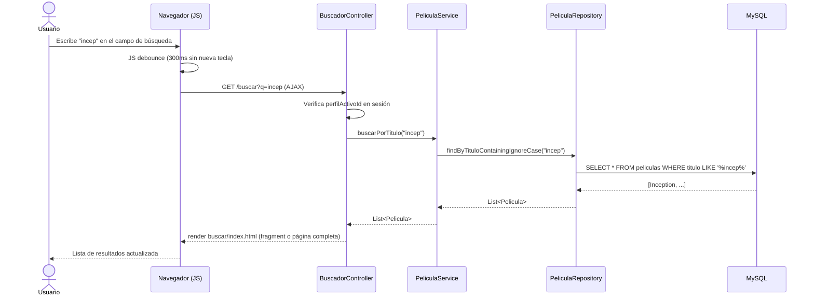

# Diagramas de Secuencia — CineTrack

Se documentan los 4 flujos más relevantes y defendibles del sistema.

---

## DS-01: Registro completo de usuario

Flujo desde que el visitante accede a `/registro` hasta que queda autenticado con su primer perfil creado.

---

## DS-02: Inicio de sesión y selección de perfil

---

## DS-03: Añadir película a Mi Lista (flujo AJAX)

---

## DS-04: Búsqueda de películas en tiempo real (AJAX)

